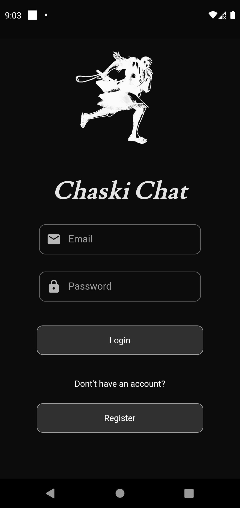

# chat_take_home_test CHASKI CHAT

A take-home-test Flutter project.

## Getting Started

This project is a starting point for a Flutter application.

A few resources to get you started if this is your first Flutter project:

- [Lab: Write your first Flutter app](https://flutter.dev/docs/get-started/codelab)

For help getting started with Flutter, view our
[online documentation](https://flutter.dev/docs), which offers tutorials,
samples, guidance on mobile development, and a full API reference.

## How to run the Project

Once the latest Flutter version has been installed, type the following command lines in the Project root folder:
> flutter pub get
> flutter run

## Screenshots

